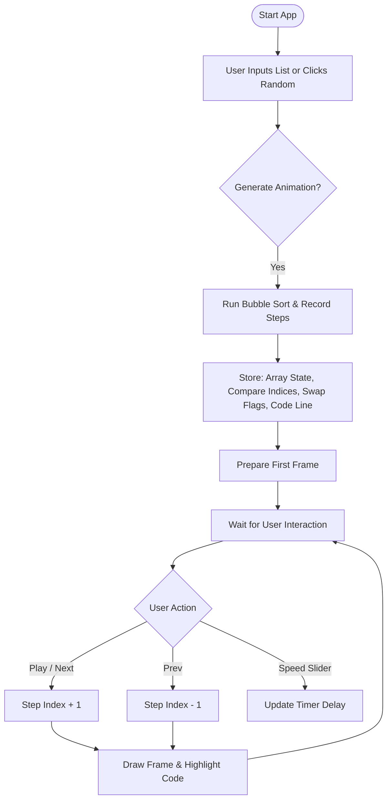

## CISC121 Final Project -- Bubble Sort Visualizer

Yunhan Zhang 20541605

## 1. Demo 

## 2. Computational Thinking

### Decomposition:

The Bubble Sort visualization can be broken down into several smaller components.

First, the user inputs a list of up to 20 integers within the range of 0–100, or generates a random list. Second, the program runs Bubble Sort while recording every comparison, swap, and array state as an individual step. Next, each recorded step is converted into a visual frame using a bar chart, where the program highlights the elements being compared and uses arrows to indicate swaps. The UI layer then displays these frames and provides interactive controls such as Prev, Next, Play, Pause, and Speed Adjustment. Finally, the app highlights the corresponding line of Python code for each step, helping users understand how the algorithm executes internally.

### Pattern Recognition:

Bubble sort has a repetitive pattern. 

1) Compare two adjacent values

2) Swap them if they are out of order

3) Continue to the next pair

4) After each full pass, the largest remaining value “bubbles” to the correct position

5) Reduce the unsorted portion by one and repeat the entire pattern

### Abstraction:

Shown to the user:

1) Current list state as a bar chart

2) The two values being compared (highlighted in orange)

3) Swap actions (shown with a red arrow)

4) The Python code line currently being executed (using <--- 👈 RUNNING to highlight)

5) Navigation controls and animation speed slider

Hidden from the user:

1) Internal Python variables

2) Loop counters

3) Memory-level operations

4) Low-level drawing details

### Algorithm Design:

(1) Input:

The user provides a list of integers or generates a random list within the range of 0–100.

(2) Processing:

The program uses bubble_sort_steps() to record:

    1) the state of the array at each step

    2) the indices being compared

    3) swap actions

    4) the active line of code

(3) Output:

The system displays:

    1) a bar chart visualization for each step

    2) a code execution trace shown side-by-side

    3) interactive UI controls (Prev, Next, Play, Pause, Speed)

    4) a slider for adjusting animation speed

## 3. Flowchart

## 4. Algorithm choice explanation

I chose Bubble Sort because it is a classic introductory sorting algorithm. Its simple and iterative structure makes it easy for beginners to follow and understand how comparisons and swaps gradually lead to a fully sorted list. The step-by-step process of comparing and swapping adjacent values also makes it very suitable for visualization. Since Bubble Sort works in-place and only changes a small part of the list at a time, the animation clearly shows how the list becomes more sorted after each step. Many students are already familiar with Bubble Sort, which makes the visualization more accessible and helpful for beginners.

## 5. Feature list

1) Accepts user input of up to 20 integers (0–100)

2) One-click random list generation

3) Step-by-step Bubble Sort visualization

4) Highlights the two compared values in each step

5) Shows swap actions with a curved red arrow

6) Displays the corresponding line of Python code during each step

7) Provides interactive controls: Prev, Next, Play, Pause

8) Includes a slider to adjust animation speed

9) Automatically stops when the animation reaches the final step

10) Clean and simple Gradio interface that is easy to use

## 6. Steps to run

1) Clone the repository: git clone https://github.com/zyunhan886-tech/bubble-sort-visualizer.git

2) Enter the project folder: cd bubble-sort-visualizer

3) Install the required packages: pip install -r requirements.txt

4) Run the application: python app.py

5) After running, Gradio will automatically open a local link in your browser. If not, look for something like: Running on local URL:  http://127.0.0.1:7860

## 7. Hugging Face link

https://huggingface.co/spaces/Yunhan8585/CISC121_bubble_sort

## 8. Testing cases + results

1) Testing case 1

Input: 30,24,77,40,71,92,96,99,31,7,51,90,18,94,29,39,34,99,0,9

Result:
    The algorithm correctly handled duplicate values (99, 99).

    It also processed minimum value 0 without issues.

    The visualization produced a fully sorted list from smallest to largest.

    Code highlighting and step navigation worked correctly.

2) Testing case 2

Input: 200,40,50,10,20

Result:

    The program did not crash and still generated the animation.

    The bar graph displayed the value 200, causing the bar to exceed the intended visual range.

    This shows the program can technically sort any list, but visually it works best within 0–100.

3) Testing case 3

Input: a, b, c

The program detected invalid input.

No animation was generated.

This confirms that non-numeric input is safely rejected.

## 9. Acknowledgment 

I would like to thank Professor Ruslan Kain for explaining how to use Gradio in CISC-121 and for providing clarification by email about how to highlight code in the UI. I also want to thank my father for encouraging me and supporting me throughout this project.